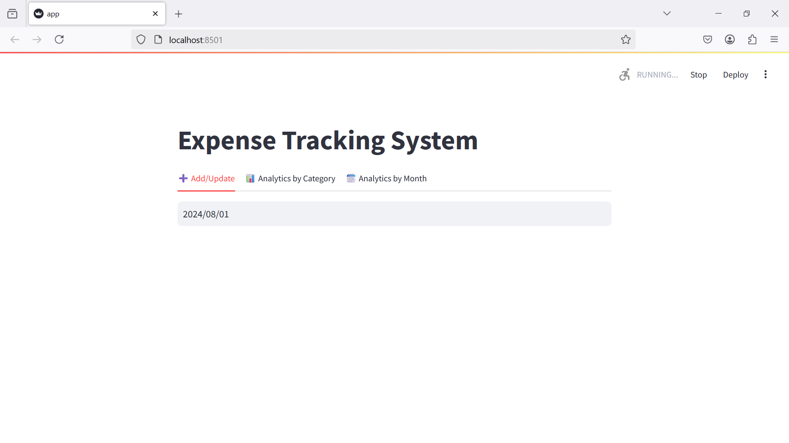
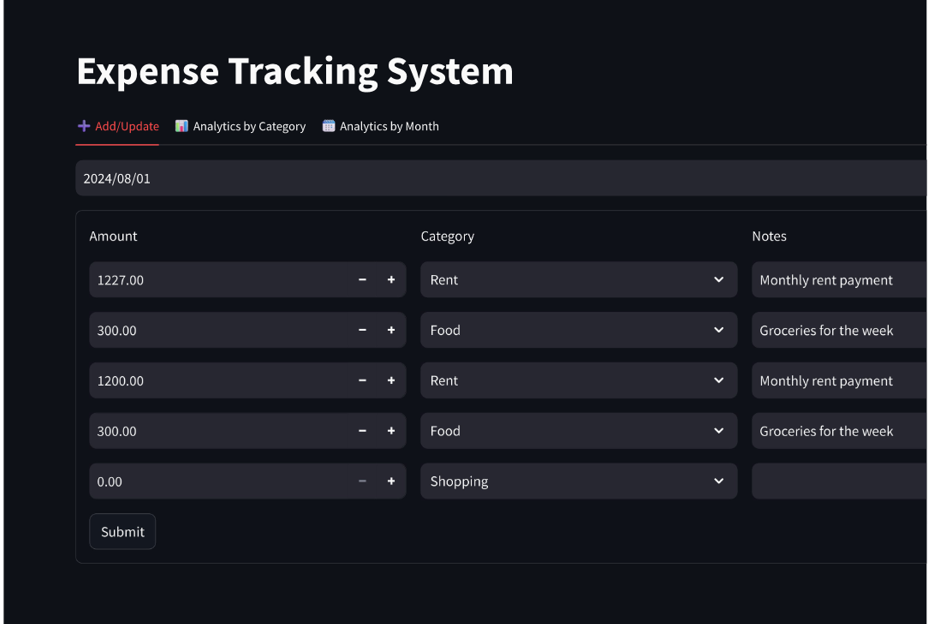
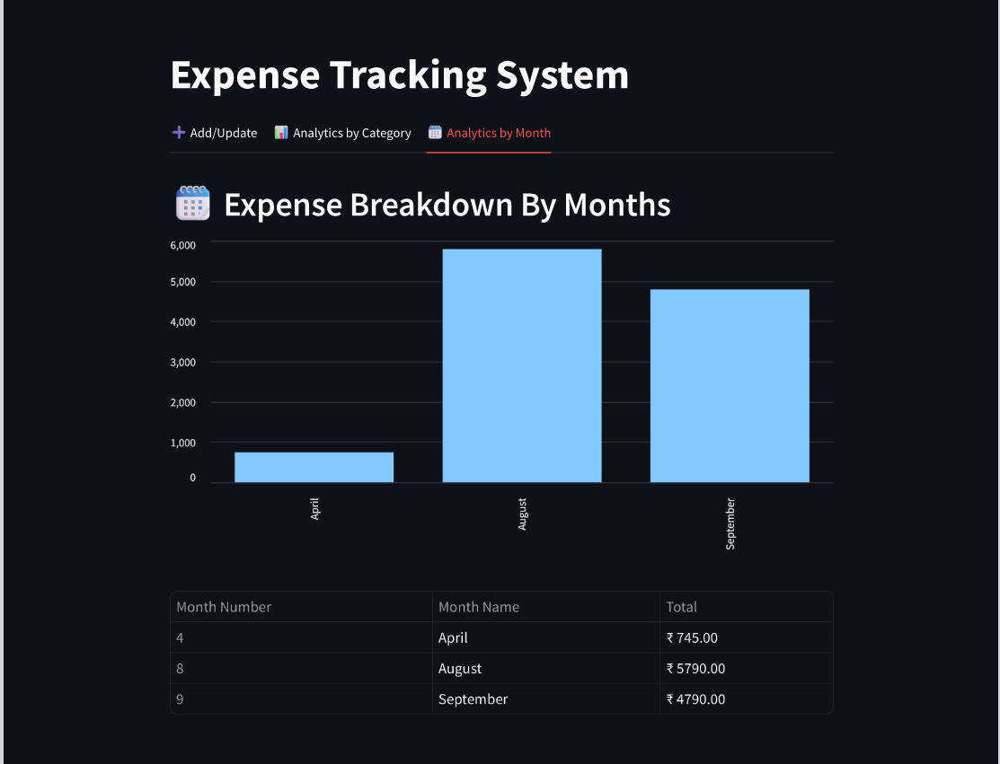
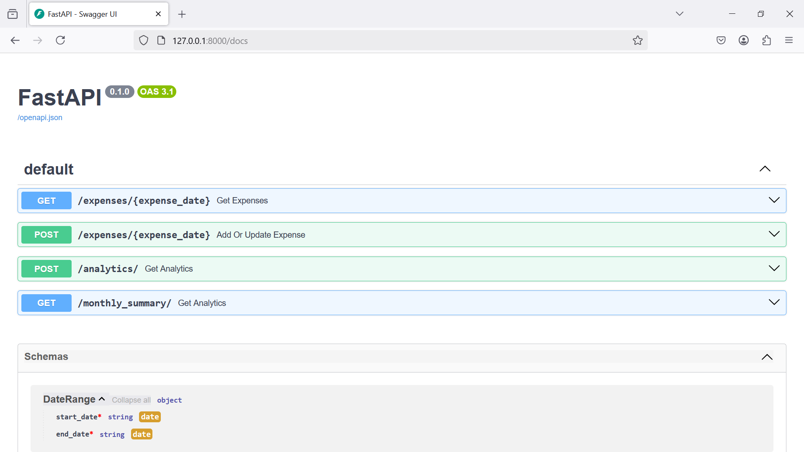
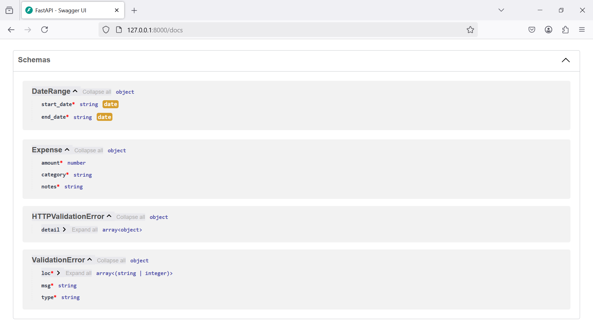

# 💼 Expense Management System

The **Expense Management System** is a full-stack application designed to help users track and analyze their expenses with ease. It uses **FastAPI** for the backend and **Streamlit** for the frontend, backed by a MySQL database for reliable data storage and retrieval.

---

## 📌 Features

- ✅ Add, update, and delete expenses
- 📅 Track daily and monthly expenses
- 📊 View summary by category and time range
- 📈 Interactive bar charts and data tables
- 📀 Persistent storage using MySQL
- 🔧 Modular codebase with logging and error handling

---

## 📸 Project Demo

### 🏠 Home Page  


### ➕ Add / Update Expense  


### ⚙️ Analytics by Category


### 📊 Monthly Analytics  


### ⚙️ FastAPI Docs  



---
## 📂 Project Structure

```
expense-management-system/
├── backend/                  ✅ FastAPI backend files
│   ├── server.py
│   ├── db_helper.py
│   └── logging_setup.py

├── frontend/                 ✅ Streamlit UI
│   ├── app.py
│   ├── add_update_ui.py
│   ├── analytics_by_category.py
│   └── analytics_by_months.py

├── screenshots/             ✅ Demo images for README.md
│   ├── home_page.png
│   ├── add_expense.png
│   ├── monthly_analytics.png
│   ├── fastapi_docs.png

├── tests/                   ✅ Testing folder
│   └── test files...

├── requirements.txt         ✅ List of dependencies
└── README.md                ✅ Project overview, instructions, and screenshots

 
```

---

## ⚙️ Setup Instructions

### 1. Clone the Repository

```bash
git clone https://github.com/yourusername/expense-management-system.git
cd expense-management-system
```

### 2. Create and Configure Database
Run the following SQL commands to create the required database and table:
```sql
CREATE DATABASE expense_manager;

USE expense_manager;

CREATE TABLE expenses (
    id INT AUTO_INCREMENT PRIMARY KEY,
    expense_date DATE NOT NULL,
    amount DECIMAL(10, 2) NOT NULL,
    category VARCHAR(100),
    notes TEXT
);
```

### 3. Set Environment Variables

Create a `.env` file or export variables manually:

```env
DB_HOST=127.0.0.1
DB_USER=root
DB_PASSWORD=root
DB_NAME=expense_manager
```

### 4. Install Python Dependencies

```bash
pip install -r requirements.txt
```

### 5. Run the Backend Server

```bash
uvicorn backend.server:app --reload
```

> The FastAPI server will run at `http://localhost:8000`

### 6. Launch the Frontend

```bash
streamlit run frontend/app.py
```

> The Streamlit app will open automatically in your browser.

---

## 🧪 Run Tests

Make sure your MySQL and API server are running before testing.

```bash
pytest tests/
```

---

## 🔗 API Overview

| Method | Endpoint                 | Description                        |
|--------|--------------------------|------------------------------------|
| GET    | /expenses/{date}         | Fetch expenses for a given date    |
| POST   | /expenses/{date}         | Add or update expenses for a date  |
| GET    | /expenses/by_month       | Monthly expense summary            |
| POST   | /analytics/              | Category-wise expense breakdown    |
| GET    | /monthly_summary/        | Enhanced monthly summary           |

---

## 🧠 Future Improvements

- ✅ User authentication
- 📄 Export reports to CSV or PDF
- 🔍 Advanced filtering and search
- 📱 Mobile responsive UI
- ☁️ Cloud deployment (e.g., Render, Railway, Heroku)

---

## 🤝 Contributing

Contributions are welcome! Please fork the repo and submit a pull request.

---

## 📜 License

This project is licensed under the [MIT License](https://opensource.org/licenses/MIT).

---

## 🙏 Acknowledgements

- [FastAPI](https://fastapi.tiangolo.com/)
- [Streamlit](https://streamlit.io/)
- [MySQL](https://www.mysql.com/)

